

  

# Flex_Fit_P4

View here: [Flex Fit P4](https://flex-fit-p4-dd9237a311ff.herokuapp.com/)

## Description

Flex Fit is an e-commerce web application built using Django. Flex Fit sells fitness clothing for men and women. The site allows users to browse clothing products, select sizes, add items to a shopping cart, and complete a secure checkout process.

The application supports user authentication, enabling users to create accounts, log in and view their order history. Admin users can manage products, stock levels and customer orders through the Django admin interface.

The web site focuses on delivering core e-commerce functionality with a clean, minimal design and a responsive user experience across desktop, tablet and mobile devices.

## Project requirments

This project was developed to meet the requirements of a full-stack Django web application with CRUD functionality, authentication, and a relational database.

The key project requirements include:

### Core Requirements:

* Build a full-stack web application using Django.

* Implement CRUD functionality for managing products and orders.

* Use a relational database (SQLite during development).

* Apply user authentication and authorisation.

* Ensure the application is responsive and user-friendly.

* Deploy the project to a live hosting platform.

### E-commerce Functionality

* Allow users to browse products with images, prices, and size options.

* Enable users to add, update, and remove items from a shopping cart.

* Provide a secure checkout process with order confirmation.

* Store completed orders in the database.

### Security and Access Control

* Restrict access to certain pages to authenticated users only.

* Display navigation options based on user login status.

* Implement custom 403 and 404 error pages.

### Admin Functionality

* Allow admin user to add, edit, and delete products.

* Mangage stock levels through the admin interface.

* View customer orders and order line items.

## User stories

| User Story | Requirement Met | Implementation | Screenshot |
|------------|----------------|----------------|------------|
| As a user, I want to browse and purchase fitness clothing for men and women. | Flex Fit e-commerce platform. | The homepage and the shop page display a range of men's and women's fitness clothing. | 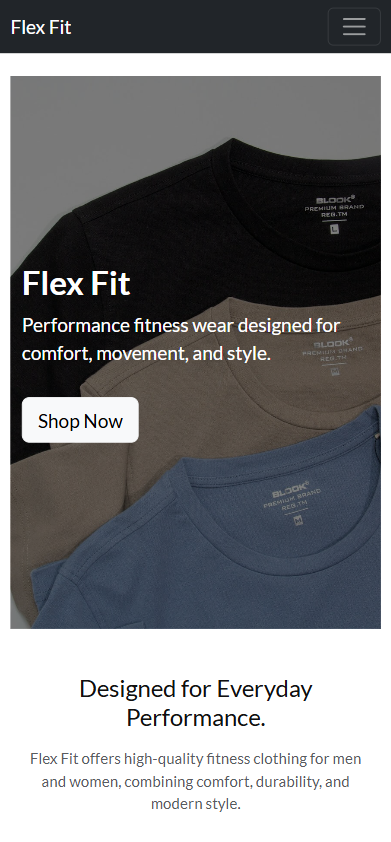 |
| As a user, I want to create an account so that I can place orders and view my order history. | User registration. | Users can sign up using Django Allauth via a registration form. | 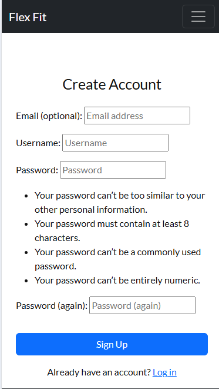 |
| As a user, I want to log in and log out securely. | Authentication. | Login and logout functionality is implemented using Django Allauth. Navigation links change based on authentication status. | 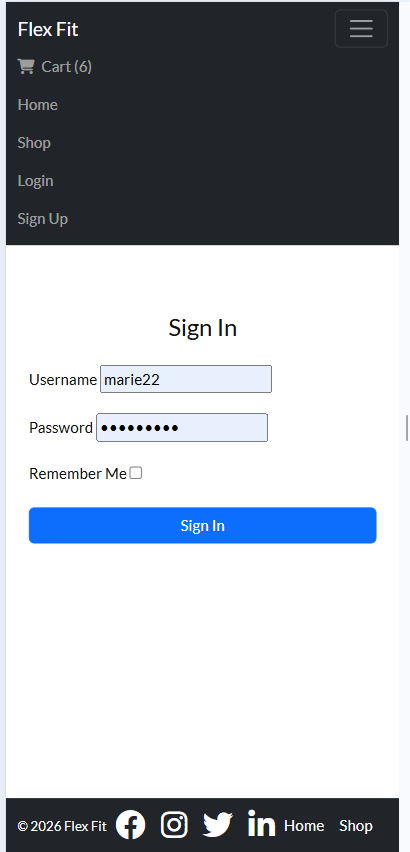 |
| As a user, I want to browse products. | Shop page. | Products are displayed on the shop page with images and prices. | 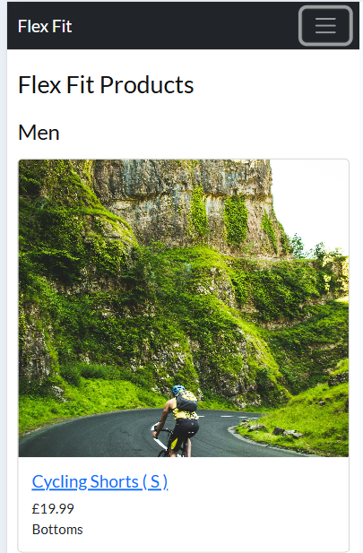 |
| As a user, I want to view detailed product information so that I can make an informed decision. | Product detail page. | Clicking on a product image or button takes the user to a product detail page showing description, price and size. | 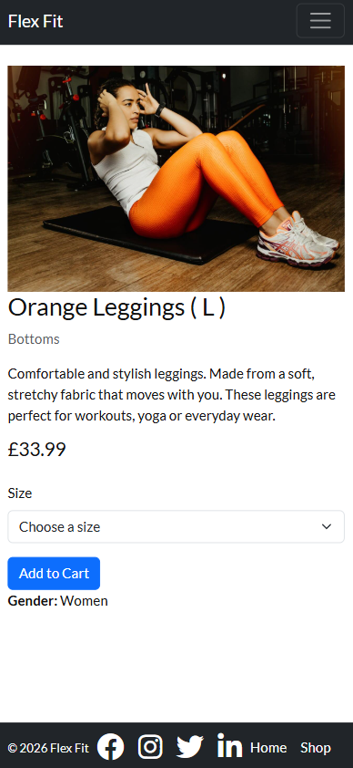 |
| As a user, I want to add products to a shopping cart so that I can review, update or remove items before completing my purchase. | Shopping cart functionality. | Users can add products, view the cart via the navigation icon, update quantities, and remove items. | 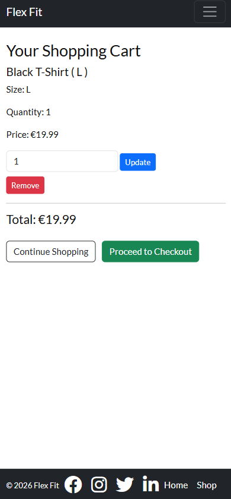 |
| As a user, I want to proceed to checkout so that I can complete my purchase. | Checkout process. | A checkout page allows users to enter delivery details. | 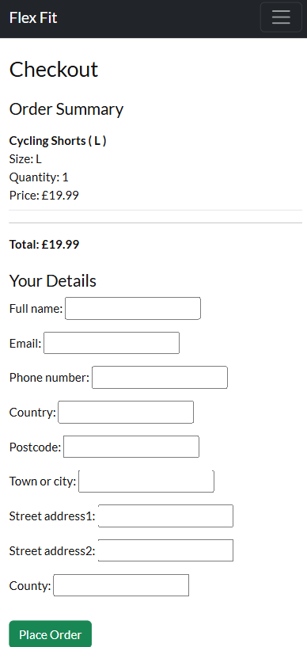 |
| As a user, I want to receive confirmation after placing an order. | Order confirmation. | After checkout, users are shown an order success page with an order number. | 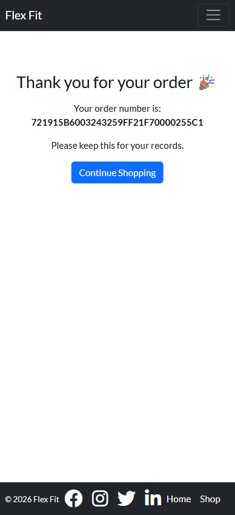 |
| As a logged-in user, I want to view my past orders. | Order history. | Authenticated users can access a "My Orders" page displaying previous orders. | 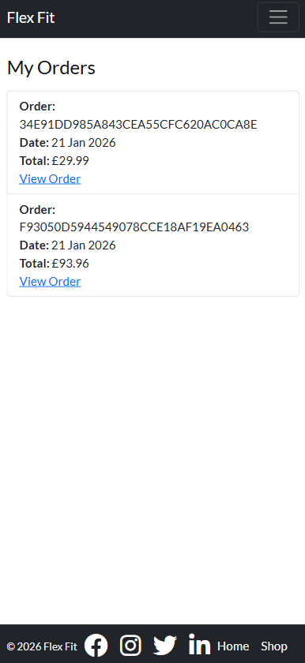 |

## Features

### User Accounts and Authentication

* Users can create an account, log in, and log out securely.
* Authenticated users can view their personal order history.
* Restricted pages are protected so only logged in users can access them.

---

### Product Browsing

* Users can browse products displayed with images, prices and size options.
* Featured products are highlighted on the homepage.
* Product images are clickable for easy navigation to product detail page.

---

### Shopping Cart

* Users can add products to the cart.
* A cart icon in the navigation bar displays the current cart status.
* Users can update quantities or remove items from the cart.

---

### Checkout and Orders

* Secure checkout process with order summary.
* Orders are saved to the database upon successful checkout.
* Users receive an order confirmation page displaying their order number.
* Logged in users can view past orders via the "My Orders" page.

---

### Admin Management

* Admin users can add, edit, and delete products through the Django admin panel.
* Stock levels are managed per product.
* Orders and order line items are visible in the admin interface.

---

### Responsive Design

* The site is fully responsive and works across desktop, tablet and mobile devices.
* Built using Bootstrap to ensure consistent layout and styling.

---

### Error Handling

* Custom 403 and 404 error pages are implemented for improved user experience.
* Authentication prevents unauthorised access to restricted pages.

## Future Features

### Advanced Product Variations

* Implement a system to manage sizes and other attributes like colour as variations of a single product in the admin interface, simplifying stock management.

---
  
### Improved Search and Filtering

* Add filters for size, price and category to help users find products more easily.

---

### Enhanced User Accounts

* Include features like a wishlist, favorites and profile management.

---

### Separate Men's and Women's Pages

* Add separate shopping pages for Men's and Women's products to improve naviagation and filtering and to improve user experience.

---

### Saved Delivery Details

* Allow logged in users to save delivery information to speed up future checkouts.

---

### Stripe Payment Integration

* Integrate Stripe to enable real online payments. Payments are currently simulated to focus on core e-commerce functionality with the project timeframe.

---

### Logo

* Develop a custom logo to improve visual recognition across the site.

---

### Persistent Product Images

* Use a cloud based storage solution (e.g. Cloudinary) to allow product images to persist in production.

---

### Product Reviews

* Allow users to leave reviews and ratings for products.

---

### Order Status Tracking

* Allow users to view order status updates such as "Processing" or "Dispatched.

## Design

### Design Limitations: 

**Product Size Variations:**

Product sizes ( S, M, L ) are implemented as separate products instead of selectable size options within a single product in the admin interface.

On the website, users can still select their size but in the admin, each size is managed as an individual product. This design keeps the product, cart, checkout, and order logic simple and reliable within the project timeframe. Each size is treated as its own product with an individual stock level, which helps ensure accurate ordering and stock management.

As a result, the same product appears multiple times in the shop, once per size. A more advanced size variation system would be implemented in the future and is documented in the Future Features section.

**Men's and Women's Product Pages:**

Separte Men's and Women's pages were not implemented in this project. All products are displayed on a single shop page.

This decision was made to keep the project focused on core e-commerce funtionality within the project timeframe. Products are still labelled by gender, allowing users to browse easily. Separate category pages are planned as a future feature.

### Database Schema

The project uses Django's built in ORM with SQLite database. 

---

### User ( Django Default Model )

| Field | Type | Purpose |
|------|------|--------|
| id | Integer | Unique identifier for each user |
| username | CharField | Used for user authentication |
| email | EmailField | Stores the user’s email address |
| password | Hashed | Securely stores the user’s password |
| is_staff | Boolean | Allows access to the admin panel |
| is_superuser | Boolean | Grants full administrative permissions |

The User model handles authentication and is linked to customer orders.

---

### Category Model

| Field | Type | Purpose |
|------|------|--------|
| id | Integer | Unique identifier for each category |
| name | CharField | Name of the category |
| description | TextField | Optional category description |

Categories are used to group products for easier organisation and browsing.

---

### Product Model

| Field | Type | Purpose |
|------|------|--------|
| id | Integer | Unique identifier for each product |
| name | CharField | Name of the product |
| category | ForeignKey (Category) | Links product to a category |
| price | DecimalField | Price of the product |
| size | CharField | Product size (S, M, L, XL) |
| gender | CharField | Target gender (Men, Women, Unisex) |
| stock_quantity | PositiveIntegerField | Available stock |
| description | TextField | Product description |
| is_active | Boolean | Controls product visibility |
| image | ImageField | Product image |

Each size variation is stored as a separate product, as documented in the Design Limitations section.

---

### Order Model

| Field | Type | Purpose |
|------|------|--------|
| id | Integer | Unique identifier for each order |
| order_number | CharField | Automatically generated order reference |
| user | ForeignKey (User) | Links order to a registered user |
| full_name | CharField | Customer’s full name |
| email | EmailField | Customer’s email address |
| phone_number | CharField | Customer’s phone number |
| country | CharField | Delivery country |
| postcode | CharField | Delivery postcode |
| town_or_city | CharField | Delivery city |
| street_address1 | CharField | Primary street address |
| street_address2 | CharField | Secondary address (optional) |
| county | CharField | County (optional) |
| date | DateTimeField | Date the order was created |
| order_total | DecimalField | Total cost of the order |

Orders are created during checkout and linked to the user when logged in.

---

### OrderLineItem Model

| Field | Type | Purpose |
|------|------|--------|
| id | Integer | Unique identifier for each line item |
| order | ForeignKey (Order) | Links item to an order |
| product | ForeignKey (Product) | Product included in the order |
| size | CharField | Selected product size |
| quantity | PositiveIntegerField | Quantity ordered |
| lineitem_total | DecimalField | Total cost for the line item |

Each order can contain multiple order line items.

---

### Colour Scheme

| Element                | Colour / Class          | Purpose |
|------------------------|------------------------|---------|
| Navbar background.     | Dark gray / Bootstrap bg-dark (#212529). | Strong contrast, clean and modern look. Matches the footer. |
| Navbar text and buttons.| Bootstrap navbar-dark links (#f8f9fa). ( Logo text is white. ) | Subtle styling to complement the white logo text and maintain readability. |
| Footer background.      | Dark gray / Bootstrap bg-dark (#212529). | Matches the navbar for a consistent layout. |
| Page background.        | White (#FFFFFF).         | Clean and makes the content easy to read. |

| Navbar | Footer | Homepage | View Product Button |
|--------|--------|----------|-------------------|
| 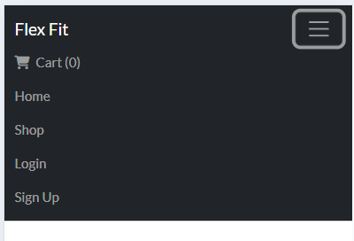 | 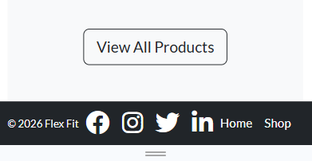 |  | 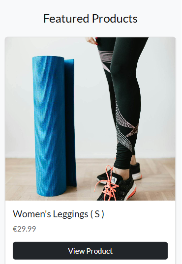 |

### Button Styling

| Element                    | Colour      | Purpose |
|----------------------------|------------|---------|
| Add to Cart / Primary Action.| Green.    | Indicates a positive action. |
| Edit button.                 | Blue.       | Standard action for editing content. |
| Delete button.               | Red.        | Brings attention to a destructive action. |
| Shop now (Hero Section).     | White.        | Stands out againt the dark background, encourages users to start shopping. |
| View Product Buttons.        | Bootstrap btn-dark. | Directs users to the products. |

### Typography

- **Primary Font:** Lato from Google Fonts. 
- **Fallback Font:** Sans-serif in case Lato doesn’t load.

Lato is clean and highly readable. It complements the minimalist colour scheme of the website and works well with Bootstrap styling.

### Homepage Styling

* **Hero Section:** Hero section has a dark overlay, large heading, and a call to action button.

* **Intro Section:** Centered text with a muted paragraph, which highlights the brands mission.

* **Featured Products:** Responsive grid using Bootstrap cards, showing image, name, price, and a "View Product" button.

* **Buttons:**
  
  **Shop Now:** Light button on the dark hero background for contrast.
  
  **View Product and View All Products:** Dark and outling buttons to stand out.

## Wireframes

Wireframes were created using Canva to plan the layout and stucture of the website for both mobile and desktop devices.

You can view the wireframes here: [View Wireframes](docs/wireframes.md)

## Technologies used

* Python – Core programming language used to build the backend logic.

* Django – Python web framework used to develop the application.

* HTML – Used for structuring the website content.

* CSS – Used for custom styling and layout.

* Bootstrap – Frontend framework used for responsive design and layout.

* SQLite – Database used during development.

* Git – Version control system used to track changes.

* Heroku – Cloud platform used to deploy the application.

## Tools used

* GitHub – Used to host the project repository.

* VS Code – Code editor used to write and manage the project.

* Django Admin – Used to manage products, orders, and site data.

* Chrome DevTools – Used for debugging, testing responsiveness, and inspecting elements.

* Google Fonts – Used to import the Lato font for site typography.

* TinyPNG – Used to compress images to improve site performance.

* Cloudinary - Used to host and manage product images.

## Deployment

**Known issues / Deployment notes:**

* Product images uploaded via the Django admin interface do not show on Heroku due to its ephemeral filesytem.
  In a production environment, a cloud based media storage solution such as Cloudinary would be implemented.

---

**Deployment steps:**

The project was deployed to Heroku using the following steps:

**1. Create a new Heroku app:**

* Log in to Heroku
* Click New → Create new app
* Choose an app name
* Select the EU region

---

**2. Configure environment variables:**

* Navigate to Settings → Reveal Config Vars
* Add the following variables:
  - SECRET_KEY
  - DEBUG (set to False in production)

---

**3. Prepare the project for deployment:**

* Install required packages:
  - gunicorn
  - python-dotenv
  - Update requirements.txt
  - Create a Procfile with: web: gunicorn main.wsgi

---

**4. Configure Django settings:**

* Set SECRET_KEY to use environment variables
* Set DEBUG to False for production
* Configure ALLOWED_HOSTS to include the Heroku app URL

---

**5. Deploy to Heroku:**

* Connect the Heroku app to the GitHub repository
* Enable automatic or manual deploys
* Deploy the main branch

---

**6. Finalise deployment:**

* Run migrations on Heroku
* Create a superuser for admin access
* Verify the application loads correctly

---

**Forking the Repository:**

1. Log in to GitHub

2. Navigate to the repository

3. Click the Fork button in the top-right corner

4. A copy of the repository will be created in your GitHub account

---

**Cloning the Github Respository:**

1. Choose the location where you want to store the cloned repository.

2. Open your terminal or command prompt.
  
4. In the terminal, type the folling command: git clone and your https://github.com/yourusername/your-repo.git
  
5. After cloning the repository, change the directory into the project folder by using the cd command: *cd your-repo-name *Now you can open the cloned repository in a code editor and make changes.

## Security

- User login and registration are handled using Django Allauth.
- Sensitive pages such as order history are protected using Django’s "login_required" decorator.
- Users who are not logged in are redirected to the login page.
- Navigation links change based on whether the user is logged in or not.
- Direct URL access to protected pages is blocked.

## Testing

## Responsive Design Testing

The Home page was tested for responsiveness using browser developer tools. Testing was carried out on, mobile, tablet and desktop screen sizes. On Chrome, Edge and Firefox browsers. The layout adapts correctly across all tested screen sizes and browsers.
Find the screenshots of the responsive testing here: [Responsive Testing Screenshots](docs/responsive_testing.md)

## Lighthouse Reports

The site's performance and best practices were evuluated using Google Lighthouse. Reports were generated for the home, shop, cart, login and sign-up pages. 

The full Lighthouse reports can be viewed [here](docs/lighthouse.md).

Some best practices issues were identified on the Home and Shop pages, mostly related to minor code or resource warnings, which can be addressed in future updates.

---

## W3C Validation

The site's HTML and CSS were validated using the W3C validators.  

## HTML Markup Validation

The HTML markup was validated using the W3C Markup Validator.  

[View HTML Validation Report](docs/w3c_validation.md)  

Some minor issues were reported in the HTML, but all custom code passes validation.

---

## CSS Validation

The CSS was validated using the W3C CSS Validator.  

[View CSS Validation Report](docs/w3c_css_validation.md)  

The error reported came from the external Font Awesome CSS. All custom CSS written for this project passed validation.

---

## Manual Testing

| Feature | Test Action | Expected Result | Actual Result | Pass/Fail |
|------|-----------|----------------|---------------|-----------|
| User Registration. | Submit sign-up form with valid details. | User account is created and user is logged in. | User account created. | Pass. |
| User Registration. | Submit sign-up form with invalid or missing fields. | Error message is displayed and account is not created. | Error displayed. | Pass. |
| Login. | Log in with valid credentials. | User is logged in and navigation updates. | User logged in, navbar updated. | Pass. |
| Login. | Log in with invalid credentials. | Error message is displayed. | No error message shown. | Fail. |
| Logout. | Click logout link. | User is logged out and redirected appropriately. | User logged out and redirected to the homepage. | Pass. |
| Product Browsing. | View shop page. | Products are displayed with images, prices and buttons. | Shop page displays products with images, prices and buttons. | Pass |
| Product Detail. | Click on a product. | Product detail page loads with correct information. | Product detail page loads correctly. | Pass. |
| Add to Cart. | Add product to cart. | Product appears in cart with correct quantity. | Product added to cart. | Pass. |
| Cart Management. | Update product quantity in cart. | Quantity and total price update correctly. | Quantity and price updated. | Pass. |
| Cart Management. | Remove product from cart. | Product is removed and cart updates. | Product removed. | Pass. |
| Cart Navigation. | Click cart icon in navbar. | User is taken to cart page. | Redirected to the cart page. | Pass. |
| Checkout. | Proceed to checkout from cart. | Checkout page loads with order summary. | Checkout page loaded correctly. | Pass. |
| Checkout. | Submit checkout form with valid details. | Order is created and success page is shown. | Order created and success page shown. | Pass. |
| Order Confirmation. | Complete an order | Order number is displayed on success page. | Order number displayed on success page. | Pass. |
| Order History. | View "My Orders" as logged-in user. | Previous orders are displayed correctly. | Logged in users can view their previous orders on the my orders page.  | Pass. |
| Access Control. | Try to access order history while logged out. | User is restriced from accessing order history. | Not shown as an option in the navbar if the user is logged out. | Pass |
| Admin Product Management. | Add a product via admin panel. | Product appears on the shop page. | Product appears correctly. | Pass. |
| Admin Product Management. | Edit a product via admin panel. | Product updates correctly on the site. | product updated correctly. | Pass. |
| Admin Product Management. | Delete a product via admin panel. | Product is removed from the shop. | Product removed successfully. | Pass. |
| Error Handling. | Visit a non-existent URL. | Custom 404 error page is displayed. | Default Django 500 error page is displayed. | Fail. |

**User Feedback Testing:** ( Testing carried out with family and friends. ) 

During testing, it was noted that there was no button to continue shopping from the cart page. 

**Fix:** A "Continue Shopping" button was added to the cart page, linking back to the products page to improve user navigation.

**It was also noted:** 

* The product sizes appear as separate listings for the same product. This was a known design limiation and is documented in the Design Limiations and Future Features sections.

* That there is not a separte Men's and Women's shopping page. The reason for this is documented in the Design Limiations section and is also included in the Future Features section.

**General Feedback:** 

They reported the site was easy to navigate and liked the design of the website.

## Bugs and Fixes

| Bug | Cause | Solution | Result |
|-----|-------|----------|--------|
| CSS files not loading in templates. | Django didn’t know about the static folder. | Added STATICFILES_DIRS = [BASE_DIR / "static"] in settings.py. | CSS now loads correctly and pages display styling as expected. |
|||||
| Product images not shown. | Template did not have code to display images. | Added product.image.url to products.html. | Images now display for products. |
|||||
| Product card images did not display correctly. | Images had different dimensions, causing uneven card layouts. | Applied bootstrap card-img-top and fixed image height using CSS with object-fit:cover. | Product images now display correctly. |
|||||
| Product grid was not responsive on smaller screen sizes, it remained in a 3 column layout. | The viewport meta tag was missing from base.html.  | Added meta name="viewport" content="width=device-width, initial-scale=1" to the base template. | The product grid now stacks correctly on smaller screen sizes. |
|||||
| Cart page did not load. | Missing ( cart: ) namespace in  template tags. | Added the correct ( cart: ) namespace to all cart-related template URLs. | The cart page now loads correctly. The quanity and remove funciton now work. |
|||||
| Checkout success page returned "Template does not exist error". | The checkout success html file was placed outside of the orders/templates/orders folders. | File was placed in the correct folder. | Page now loads correctly. |
|||||
| Users could not complete a purchase after adding items to the cart. | There was no button on the cart page to go to the checkout page. | A "Proceed to Checkout" button was added to the cart page. | Users can now move from the cart to the checkout page and complete their order. |
|||||
| Checkout success page came up NoReverseMatch error when adding a "Continue Shopping" link. | Template was not using correct URL route for the button. | Updated template to use the correct URL ( products:product_list ). | "Continue Shopping" button now works and redirects to the product list page. |
|||||
| Signup failed with error "ConnectionRefusedError". | Django tried to send a confirmation email during signup, but there is no email server running. | Added "EMAIL_BACKEND = 'django.core.mail.backends.console.EmailBackend' to settings.py. | Signup works successfully. |
|||||
| Orders placed by logged in users were not appearing in the order history page. | Orders were not linked to the logged in user. | Added a user foreign key to the Order model and assigned "order.user = request.user" during checkout. | Orders now appear correctly in the order history page for logged in users. |
|||||
| Cart caused a page error. | Cart session data was stored in two different formats ( numbers or dictionary with size ). | Updated the cart context processor to handle both types. | Cart now works correctly without errors. |
|||||
| Product images failed to load after deployment. | I used Cloundinary to upload images after deployment but I had put the incorrect Cloundinary API credentials in Heroku, causing authentication failures when uploading images. | Corrected API credentials in Heroku config vars, restarted the application, and re-uploaded product images via Django admin. | Images now upload successfully to Cloudinary and display correctly on the site. |

## Known bugs / Issues

Unfortunately, these issues were not resolved before submission. They will be addressed in a future update.

---

* **Custom 404 page not displayed:** The default Django 500 page shows instead of the custom 404 and 403 pages.

---

* **Login error message not shown:** When logging in with invalid credentials, no error message appears.

---

## Credits

### **Content and Learning Resources:**

**Code Institute - Boutique Ado Tutorial**

This project was influenced by the *Boutique Ado* tutorial provided by Code Institute. The tutorial was used as a learning reference for Django e-commerce concepts. The tutorial is available via the Code Institute learning platform.

This project was developed using my own code. Standard Django template structures and web development conventions were followed throughout the project. 

### Learning and Libraries:

- [Django Documentation](https://docs.djangoproject.com/)

- [Bootstrap Documentation](https://getbootstrap.com/docs/)

### Media and Assets:

Images used throughout the site were sourced from:

- [Pexels](https://www.pexels.com/)

- [Unsplash](https://unsplash.com/)

### Image Optimisation:

- [TinyPNG](https://tinypng.com/) was used to compress images and improve performance.

### Favicon: 

- Favicon was generated using [Favicon.io](https://favicon.io/).

### Design and Typography:

**Google Fonts:**

- [Lato](https://fonts.google.com/specimen/Lato) font was imported from Google Fonts and used as the primary typography across the site.

### Wireframes:

- Wireframes were created using [Canva](https://www.canva.com/) to plan layout and page structure.

### Icons:

- Social media and user interface icons were sourced from [Font Awesome](https://fontawesome.com/).

## Acknowledgements

* **Code Institute for providing the learning materials, support and guidance.**

* **Family and friends who participated in user testing and provided valuable feedback.**

 
