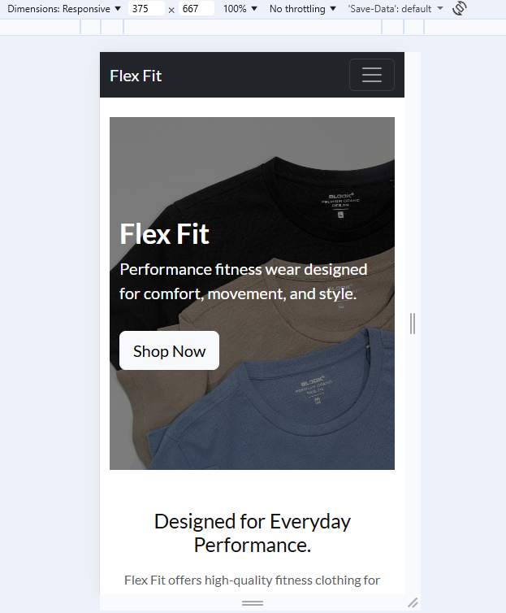
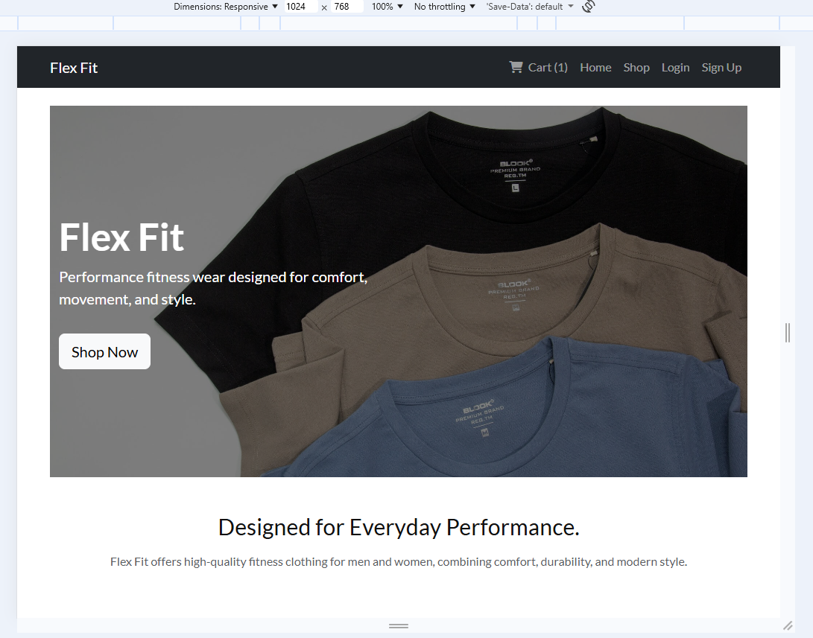
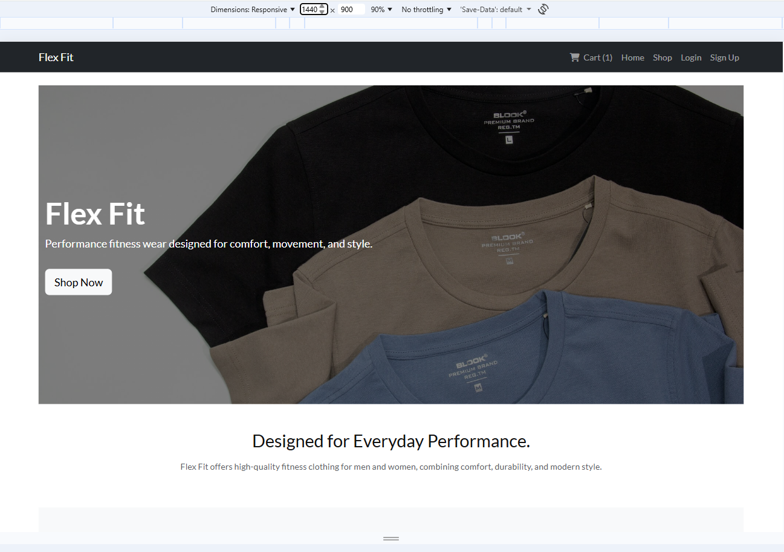
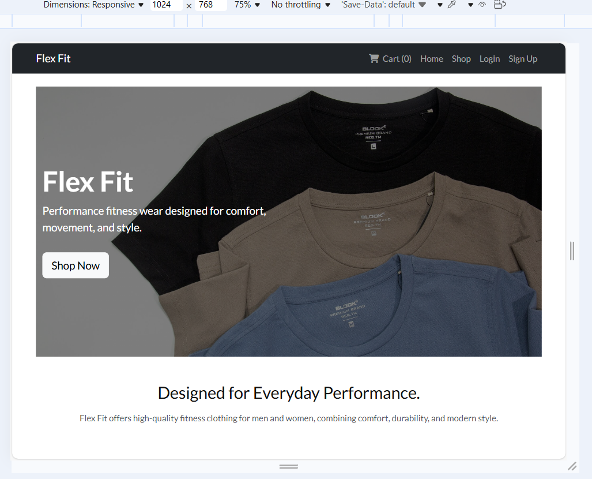
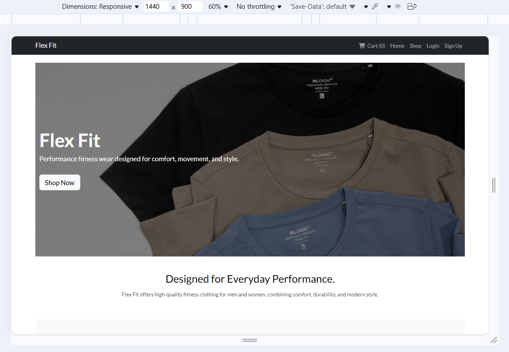
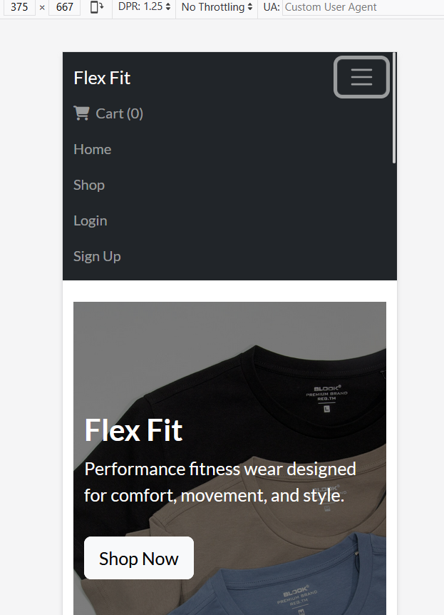
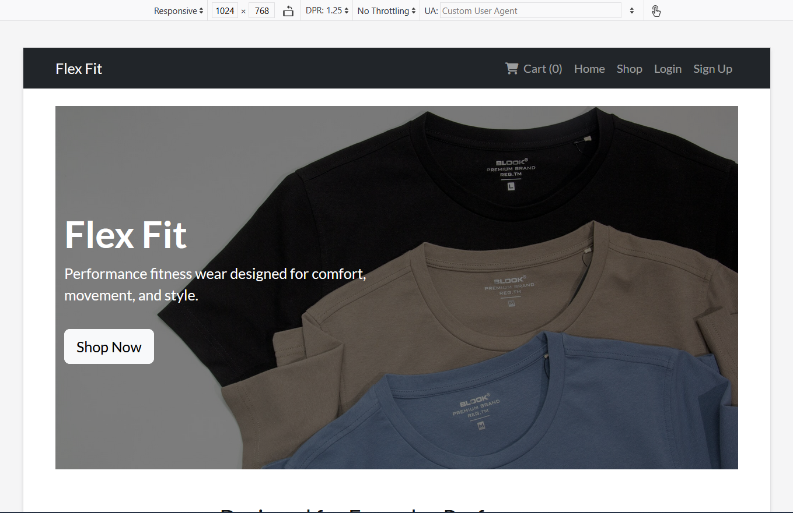
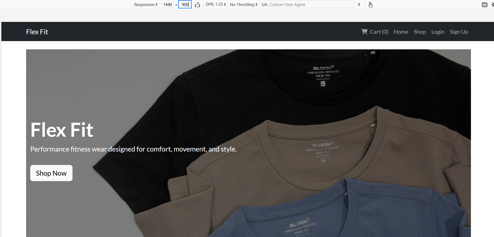

# Responsive testing screenshots

* The home page was tested for responsivness using browser developer tools. Screenshots below demonstarte that the layout adapts correctly across all tested screen sizes and browsers. Tested in Chrome, Edge and Firefox.

# Responsive testing - Chrome

## CHROME - MOBILE 

## CHROME - TABLET

## CHROME - DESKTOP 

# Responsive testing - Edge 

## EDGE - MOBILE

## EDGE - TABLET

## EDGE - DESKTOP

# Responsive testing - Firefox

## FIREFOX - MOBILE

## FIREFOX - TABLET

## FIREFOX - DESKTOP

