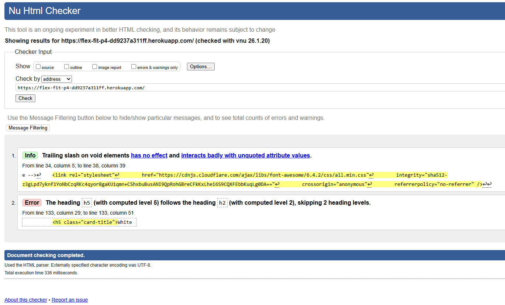

# W3C Markup Validation 

The Home page was validated using the [W3C Markup Validation Service](https://validator.w3.org/).  

Some minor issues were identified, including:
- Trailing slashes on void elements.
- Skipped heading levels (e.g., h5 following h2).  

These issues do not affect the functionality of the site and can be addressed in future updates.
